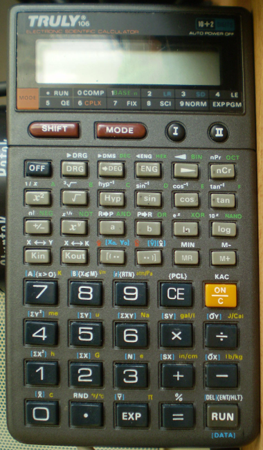

## Here it is! Truly106.
And several programs for the TRULY 106 pocket calculator. Enjoy.



The following notation will be used in the text:
```
K1  = KOUT 1
Mx  = mode x (e.g. mode 0, mode ., mode 9,...)
#q# = a variable in our notation, e.g.
      #q# ∈ {1,2,3} or
      #a# = KIN1 ; KIN2 ; KIN3
```

### Find maximum number of a sequence

- PRG SIZE: 4 steps
- REGISTERS: M = contains the maximum entered so far

```
M0 ;
I/II ENT ; X<=M ; MIN ; {RTN} ;
```

### Compute signum of an integer
#q# ∈ {1,2,3,4,5,6} Vypočíta signum čísla. Je možné použť upravenú formu tohto
programu v iných, signum vyžadujúcich programoch.

**Version 1:**
- PRG SIZE: 14 steps
```
M0 ;
I/II KIN#q# ; x² ; √x ; ÷ ;
( ; K#q# ; + ; 1 ; EXP ; 99 ; +/- ; ) ; = ;
```

**Version 2:**
Nevýhoda tejto verzie spočíva iba v tom, že nie je možné zadať číslo v
intervale (-1;0)U(0;1), pretože tieto čísla sa správajú ako 0, resp. 0,0.

- PRG SIZE: 13 steps
```
M0 ;
I/II KIN#q# ; x² ; √x ; ÷ ;
( ; K#q# ; + ; 1 ; ) ; = ;
M70 ; RND ; M9 ;
```

### Primitive timer, clock and alarm
```
 #q# ∈ {36,37,38} podľa vyťaženia baterky
 M0 ;
 I    + ; 1 ; = ; KIN1 ; X<=M ; C ; DEG ; DEG ; MR ; ÷ ; #q# ; ) ; DEG ; DMS
 M0 ;
 II   0 ; DEG ; DEG ; ( ; ( ; K1 ; - ; 1 ; ) ; ÷ ; #q# ; ) ; DEG ; DMS ;
```

- PRG: (I)-15k + (II)-15k = 30k
- REG:
  - K1 = Počítadlo času
  - M = maximálny čas, do ktorého sa bude počítať

Tento program možno použiť ako hodiny, budík a stopky.
Stlačením tlačidla `(I)` sa spustí program a stlačením `on/C` sa zastaví
a zapamätá sa posledná časová hodnota, ktorá je uložená v `K1`.
Po stlačení `(II)` sa zobrazí
```
 ┌───────────────────┐ HH = Hodiny
 │on deg             │ MM = Minúty
 │ HH"MM"SS.xx  ENTII│ SS = Sekundy
 └───────────────────┘ xx = Stotiny
```
Ak chceme použiť kalkulačku ako hodiny, musíme postupovať takto:
Navolíme aktuálny čas `HH:MM:SS = 13320*HH + 2220*MM + 37*SS` Potom stlačíme `(I)`.
Teraz už beží čas! Ak sa chceme naň pozrieť, stlačíme `on/C` a následne `(II)`
nakoniec, aby mohol čas bežať ďalej, stlačíme `K1` a `(I)`.

**POZOR!!!** Hrozí zlyhanie systému. Ak máme nainštalovaný tento program,
vypneme kalkulačku a potom ju zapneme bez resetu (ľubovolné. tlačidlo + `on/C`)
a následne spustíme program `(I)`, začne kalkulačka vykonávať krokovací režim.
Ten však bude zapnuty donekonečna, pretože program obsahuje príkaz skoku na
začiatok a neobsahuje príkaz prerušenia.

**POMOC:** Vybrať baterku.
